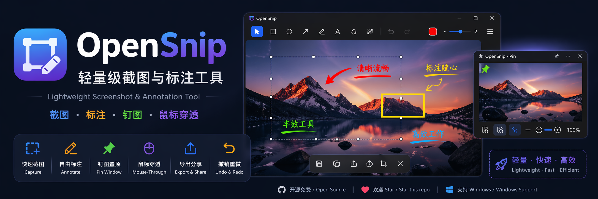

<p align="center">
  
</p>

<h1 align="center">OpenSnip</h1>

<p align="center">
  轻量级截图与标注工具<br/>
  <b>截图 · 标注 · 钉图</b>
</p>

<p align="center">
  
  
  
  
</p>

<p align="center">
  中文 | <a href="README.md">English</a>
</p>

---

## 🎬 演示

> GIF 演示占位（建议添加 5-8 秒的截图+标注+贴图演示 GIF）

<p align="center">
  
</p>

---

## ✨ 项目简介

OpenSnip 是一款**轻量级桌面截图与标注工具**，专注于效率与简洁体验。

**截图 → 标注 → 钉图 → 秒速完成**

---

## ⚡ 功能特性

| 功能 | 说明 | 状态 |
|------|------|------|
| 📸 快速截图 | 全屏、区域、窗口截图 | ✅ 可用 |
| ✏️ 标注工具 | 矩形、箭头、文字、画笔、马赛克 | ✅ 可用 |
| 🎨 样式控制 | 颜色、线宽、字号、阴影 | ✅ 可用 |
| 📌 钉图窗口 | 置顶浮动截图 | ✅ 可用 |
| 🖱 鼠标穿透 | 锁定后点击穿透 | ✅ 可用 |
| 💾 导出与复制 | 保存 PNG、复制到剪贴板 | ✅ 可用 |
| ↩️ 撤销重做 | 完整历史记录 | ✅ 可用 |
| 🔍 OCR 文字识别 | 从截图提取文字（Windows.Media.Ocr） | 🔧 已实现 |
| 🌐 翻译 | 多语言翻译（MyMemory API） | ✅ 可用 |
| 🎬 录屏 | 屏幕录制 | 🔧 即将推出 |

---

## 🚀 核心亮点

- ⚡ 秒级截图体验
- 📌 类 Snipaste 的钉图能力
- 🪶 轻量快速（Tauri v2 + Rust）
- 🔓 开源可扩展

---

## 📦 安装

### 下载安装

从 [Releases](https://github.com/2190297373/OpenSnip/releases) 下载最新版本：

- **NSIS 安装包**（推荐）: `OpenSnip_x.x.x_x64-setup.exe`
- **MSI 安装包**（标准）: `OpenSnip_x.x.x_x64_en-US.msi`

### 从源码构建

**环境要求：**
- Windows 10/11 (64-bit)
- Node.js >= 18
- Rust >= 1.70
- Visual Studio 2022 Build Tools（C++ 桌面开发）

```bash
# 克隆
git clone https://github.com/2190297373/OpenSnip.git
cd OpenSnip

# 安装依赖
npm install

# 开发模式运行
npm run tauri dev

# 构建发布版本
npm run tauri build
```

---

## 🛠 打包输出

构建完成后，安装包位于：

```
src-tauri/target/release/bundle/nsis/OpenSnip_x.x.x_x64-setup.exe
src-tauri/target/release/bundle/msi/OpenSnip_x.x.x_x64_en-US.msi
```

---

## ⌨️ 快捷键

| 快捷键 | 功能 |
|--------|------|
| `Ctrl + Alt + A` | 区域截图 |
| `Ctrl + Alt + S` | 滚动截图 |
| `Ctrl + Alt + R` | 屏幕录制 |
| `Esc` | 取消截图 |
| `Ctrl + Z` | 撤销 |
| `Ctrl + Shift + Z` | 重做 |
| `↑ ↓ ← →` | 微调选中标注 |
| `Delete` | 删除选中标注 |

---

## 🗺 开发计划

- [x] v0.1.0 — 核心截图 + 标注 + 钉图
- [ ] v0.2.0 — OCR 文字识别
- [ ] v0.3.0 — FFmpeg 屏幕录制
- [ ] v0.4.0 — 滚动截图
- [x] v1.0.0 — 稳定版发布

---

## 📌 使用场景

- 🐛 Bug 提交
- 🎨 UI 设计反馈
- 📚 教程制作
- 💬 开发沟通

---

## 🤝 贡献指南

欢迎贡献代码！请阅读 [CONTRIBUTING.md](CONTRIBUTING.md) 了解如何参与。

---

## ⭐ 支持项目

如果这个项目对你有帮助，欢迎点一个 Star ⭐

---

## 📄 许可证

本项目采用 [MIT License](LICENSE) 开源协议。
